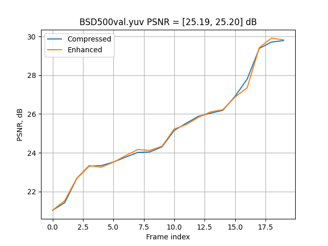

# Учебный проект, посвященный улучшению качества сжатых изображений при помощи нейронных сетей (модель QECNN)

## Датасет
Для обучения используется датасет изображений BSD500 [1]. Изображения из датасета сконвертированы в формат yuv и хранятся в едином файле:
при этом 400 изображений 480x320 находятся в файле BSD500train.yuv, и 100 изобажений находятся в файле BSD500test.yuv. Оба файла сжаты кодеком x265 с квантователем QP=35 и 
помещены в файлы BSD500train.yuv и BSD500test.yuv, соответственно.

## Модель
Модель нейронной сети заимствована из работы [2]. Эффективность работы текущей версии модели можно представить в виде графика ниже:

Код протестирован на OC Windows 10 и Ubuntu 24.

## Описание задания к лабораторной работе
Улучшить QECNN модель так, чтобы модифицированная версия:
- выиграла на 100 изображениях из файла BSD500test.yuv в среднем 0.2 дБ и более по метрике PSNR; 

Требования к реализации и результаты:
- При обучении должны использоваться только изображения из папки файла BSD500train.yuv
- Построить график функции PSNR/номер изображения для исходной и модифицированной моделей

На почту eabelyaev@itmo.ru прислать отчет в виде презентации в pdf формате, который включает в себя:
- ФИО студента, номер группы.
- Описание предложенной модификации и результаты.
- Ссылку на репозиторий с исходным кодом кодека и инструкцию по запуску.

## Литература
[1] https://github.com/BIDS/BSDS500 
[2] R. Yang et al., "Enhancing Quality for HEVC Compressed Videos," IEEE Transactions on Circuits and Systems for Video Technology, 2019.
[pdf](./doc/Enhancing_Quality_for_HEVC_Compressed_Videos.pdf)